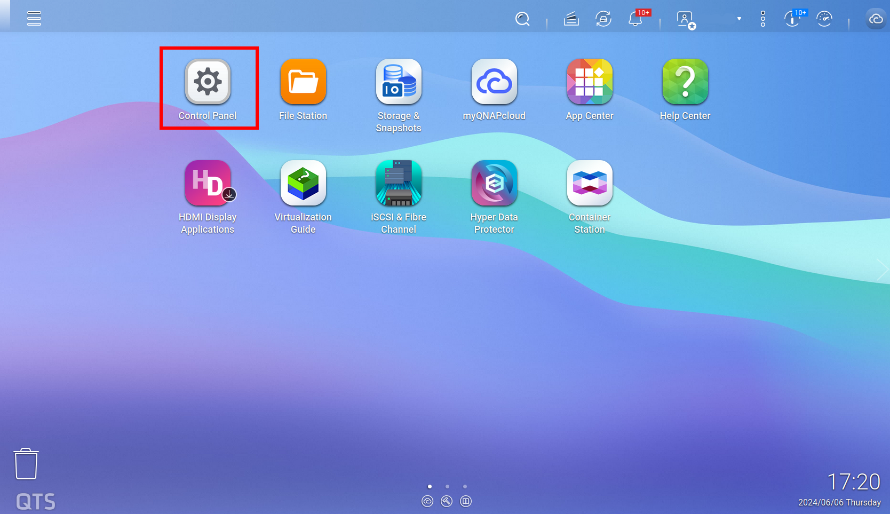
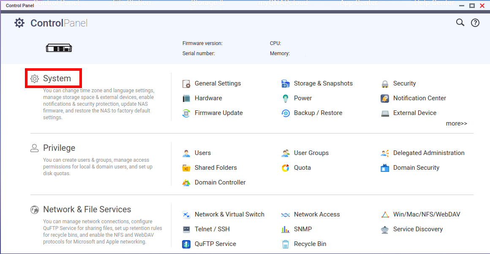
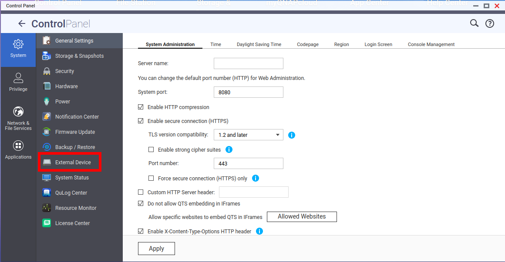
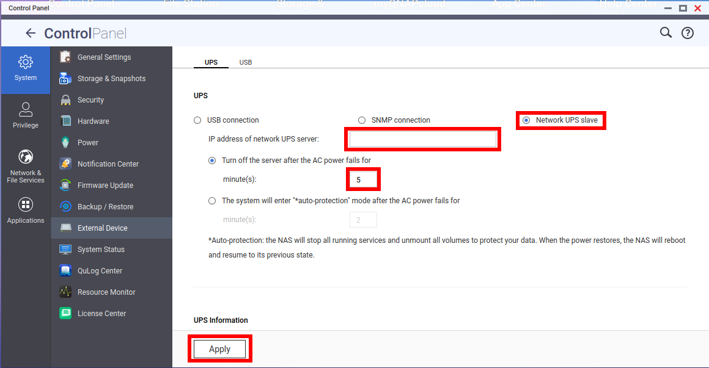

# Typical setup for UPSMON clients

## Linux based client setup

1. Install nut-client package

```
sudo apt install -y nut-client
```

2. Edit the `/etc/nut/nut.conf` file

```
sudo echo MODE=netclient > /etc/nut/nut.conf
```

3. Edit the `/etc/nut/upsmon.conf` file

```
MINSUPPLIES 1
SHUTDOWNCMD "/sbin/shutdown -h +0"
POLLFREQ 5
POLLFREQALERT 5
HOSTSYNC 15
DEADTIME 30
POWERDOWNFLAG /etc/killpower
RBWARNTIME 43200
NOCOMMWARNTIME 300
FINALDELAY 0
MONITOR <CHOSEN_UPS>@<UPSD_SERVER_IP> <POWER_VALUE> <USER> <PASSWORD> <MODE>
```

4. Restart and enable `nut-monitor.service`

```
sudo systemctl restart nut-monitor && sudo systemctl enable nut-monitor
```

5. Check logs for successful connection

```
sudo systemctl status nut-monitor
```

## QNAP (QTS 5.0) Setup

Well this setup is very wanky and you should provide additional microserver in between Central Server <-> QNAP.

If your infrastructure is small enough you can get away with editing UPS name in `ups.conf` on the central server.

QNAP supports connecting to `qnapups` named UPS with user `admin` and password `123456`

If you want to add a special microserver just for your QNAP _(one microserver can handle multiple clients but one microserver should in this case handle only one UPS)_ you should try using a cheap Raspberry/Orange Pi, use an image that NUT is currently supporting and install `nut-server`.

For `ups.conf` you should create a UPS named `qnapups`, set its driver to `dummy-ups` and specify the port (IP address)

Create an user `admin` with password `123456` in `upsd.users`

Next hop onto QNAP Admin Panel

Click Control Panel



Click System



Click External Device



Change to Network UPS Slave and enter your IP etc.



When you refresh the page at the bottom you should see data from the UPS